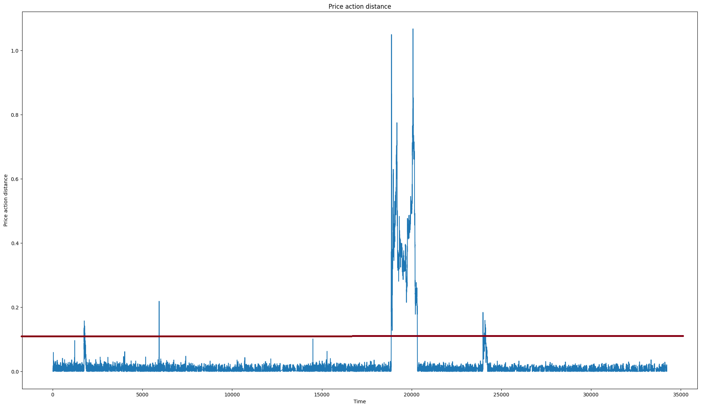

# PbLayla
Risk management strategy for Passivbot v6.x using passivbot_multi.py. Use at your own risk!

# How does it work
PB itself is doing a really great job at getting you out of the bad position with unstucking mechanism however sometimes price can completely collapse out of the capabilities of PB, e.g. major crashes, single coin crash. Have you ever wished to run your config with TWE 3.0 but you know that within 4 years in backtest it failed once or twice? This might be a solution.

This risk management strategy first tries to reallocate more wallet exposure to stuck symbol essentially lowering the position entry price. Wallet exposure reallocation can be done only to max number of coins at the same time.

When unstucking with more exposure cannot be used it will opposite position as a hedge when price action gets too far away from position price. Consider it as an insurance against price moving further from position. For example consider a fully allocated long position and price drops 15%, you might want to open short position at this distance to avoid any further loss. Whatever loss you would get on long position you would gain in short position.

When hedge occures there are two scenarios how it can play out. Either it continues going down and never recovers. In this case max loss is the distance from position price where you open the hedge. Better scenario is when the price recovers, it will close the hedge with a small loss and hopefully price will go into take profit grid of PB.

This strategy is ideal for market that can temporarily crash with a V shape recovery. The biggest weakness of this strategy is price oscilation in the range of open/close hedge. Mitigation for this weakness is to first use unstucking config and maximum number of hedge releases (losses) in sliding time period.

How to pick correct price distance where to place hedge? You might use hand tuner in PB with your favourite config and find it. For example in this chart price goes over 10% distance on average once a year. So 0.1 distance might a be a good pick as long as the cost of hedge is significantly smaller than gains. The cost of hedge depends on where you close the hedge.

The real challenge is to find the best combination of PB configs, total wallet exposure, unstucking and hedge open/close distances. For example when you run account with TWE 3.0 and you want to have maximum stop loss around -30%. The distance to open hedge should not be greater than 0.1.

This strategy can help against rare random crashes but it has its own risks so use it carefully with not a lot of wallet exposure. Keep in mind that to open hedge you still need to maintain some good margin on exchanges. When the unrealized loss gets over -50% risk happens fast and even this tool might not save it so plan your configuration accordingly!

# Setup
- Install docker
- Checkout directory
- Configure docker-compose.yml, see configuration section
- Build PB as docker image `passivbot:latest`
- Build PbLayla `docker compose build`
- Start PbLayla `docker compose up -d`

## Docker setup
This risk management in default configuration takes over the lifecycle of PB. It takes PB multi symbol template, it configures it based on the current account state and starts PB in docker. When trading conditions change and PB needs to be started in unstucking config for certain coin it stops PB and starts it in another configuration. For this to happen it needs access to docker within docker container. Based on your operating system you might need to setup permisions for docker.sock

`sudo groupadd docker`
`sudo usermod -aG docker ${USER}`
`sudo chmod 666 /var/run/docker.sock`
`sudo systemctl restart docker`

# Configuration
- PBLAYLA_PbLayla__Accounts__0__Name
  - Name of the account, could be the same name used in PB
- PBLAYLA_PbLayla__Accounts__0__ApiKey
  - Api key for the account, PB key could be reused
- PBLAYLA_PbLayla__Accounts__0__ApiSecret
  - Api secret for the account, PB secret could be reused
- PBLAYLA_PbLayla__Accounts__0__Exchange
  - Exchange, currently only 'Bybit'
- PBLAYLA_PbLayla__Accounts__0__IsUnified
  - True if it is Bybit UTA account type
- PBLAYLA_PbLayla__Accounts__0__ConfigTemplateFileName
  - PB multi config file
- PBLAYLA_PbLayla__Accounts__0__StuckExposureRatio
  - Min ratio for the coin to be considered stuck
- PBLAYLA_PbLayla__Accounts__0__MinStuckTime
  - Min time without position update for the coin to be considered stuck 
- PBLAYLA_PbLayla__Accounts__0__StageOneTotalStuckExposure
  - Wallet exposure override for a coin that is stuck
- PBLAYLA_PbLayla__Accounts__0__StateChangeCheckTime
  - How often to check PB configuration and potentially restart it if it should be changed
- PBLAYLA_PbLayla__Accounts__0__ConfigsPath
  - Config directory inside docker image, it is recommended not to change and mount it in docker-compose.yml
- PBLAYLA_PbLayla__Accounts__0__OverExposeFilterFactor
  - Filter to find out which coins are over exposed and should be preferered for unstucking
- PBLAYLA_PbLayla__Accounts__0__UnstuckConfig
  - File in ConfigsPath that represents unstuck configuration for the coin
- PBLAYLA_PbLayla__Accounts__0__UnstuckExposure
  - Wallet exposure for a single coin in unstuck mode, it should be higher value than in normal mode
- PBLAYLA_PbLayla__Accounts__0__DisableOthersWhileUnstucking
  - Option that would put all other coins that are not currently in unstuck mode to PB take profit mode so they do not add up another exposure
- PBLAYLA_PbLayla__Accounts__0__PriceDistanceStuck
  - Price distance for the coin to be considered stuck
- PBLAYLA_PbLayla__Accounts__0__PriceDistanceCloseHedge
  - Price distance where to close hedge, it should be value smaller than PriceDistanceStuck
- PBLAYLA_PbLayla__Accounts__0__PriceDistanceUnstuckStuck
  - Price distance for the unstucking coin to be considered stuck
- PBLAYLA_PbLayla__Accounts__0__PriceDistanceUnstuckCloseHedge
  - Price distance where to close hedge of the unstucking coin, it should be value smaller than PriceDistanceUnstuckCloseHedge
- PBLAYLA_PbLayla__Accounts__0__MaxHedgeReleaseAttempts
  - Maximum number of hedge release attempts in certain sliding time window
- PBLAYLA_PbLayla__Accounts__0__MaxHedgeReleaseAttemptsPeriod
  - Sliding time window for hedge releases
- PBLAYLA_PbLayla__RiskMonitor__MaxUnstuckSymbols
  - Maximum number of symbols that can be in unstucking mode with higher wallet exposure and unstucking config
- PBLAYLA_PbLayla__Docker__DockerHost
  - Docker host path, usually it does not need modification
- PBLAYLA_PbLayla__Docker__MountConfigsPath
  - Path to the folder where the configs are stored on the host machine
- PBLAYLA_PbLayla__Docker__MountApiKeysPath
  - Path to the api-keys.json on the host machine

  # Limitations
- Risk management only for long positions (it uses short to hedge it)
- Bybit Exchange
